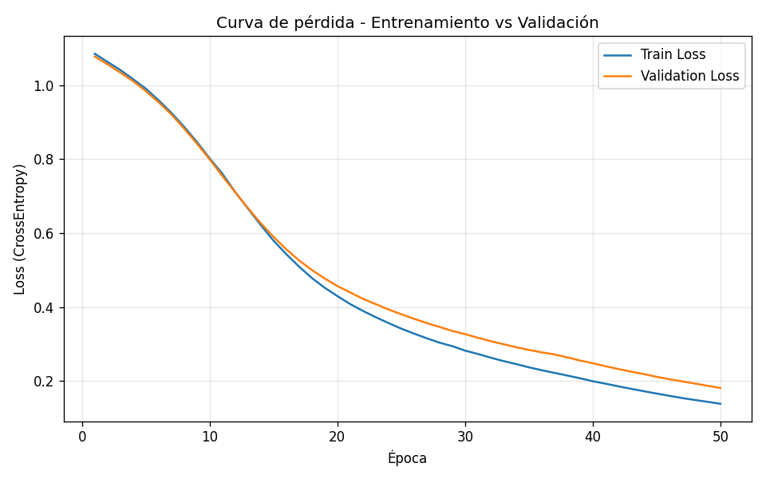

# Pipeline Base - PyTorch

Infraestructura técnica inicial de un proyecto integrador de Machine Learning: un ciclo de entrenamiento funcional en PyTorch, con detección automática de dispositivo, un modelo `nn.Module`, y un pipeline de entrenamiento/validación reproducible.

## Estructura del repositorio

```
pipeline_base/
├── data/                   # Dataset (se genera automáticamente en la primera corrida)
│   └── iris.csv
├── notebooks/
│   └── 00_pipeline_demo.ipynb   # Notebook demostrativo end-to-end
├── results/                # Se genera al entrenar: historial de loss/accuracy, checkpoint, gráfico
│   ├── history.json
│   ├── loss_curve.png
│   └── model_checkpoint.pt
├── src/
│   ├── device.py           # Detección automática de GPU/MPS/CPU
│   ├── model.py             # Arquitectura MLPClassifier (nn.Module)
│   ├── data.py               # Carga, split y estandarización del dataset
│   └── train.py               # Loop de entrenamiento y evaluación
├── requirements.txt
├── .gitignore
└── README.md
```

## Cómo correrlo

```bash
python -m venv venv
source venv/bin/activate        # En Windows: venv\Scripts\activate
pip install -r requirements.txt

cd src
python train.py
```

También se puede correr paso a paso desde `notebooks/00_pipeline_demo.ipynb`.

## Dataset

Se usa el dataset clásico **Iris** (150 muestras, 4 features numéricas, 3 clases balanceadas) cargado desde `sklearn.datasets`. Se eligió por ser liviano y estándar para validar que la infraestructura del pipeline funciona correctamente antes de escalar a un dataset real. El CSV crudo se persiste en `data/iris.csv` para dejar registro del insumo, y el split train/validación (80/20, estratificado) junto con la estandarización de features se aplican en `src/data.py`, ajustando el `StandardScaler` únicamente sobre el set de entrenamiento para evitar data leakage.

## Arquitectura del modelo

`MLPClassifier` (en `src/model.py`): un perceptrón multicapa simple.

```
Input(4) → Linear(16) → ReLU → Linear(16) → ReLU → Linear(3) → logits
```

Se usa `nn.CrossEntropyLoss`, que ya incluye softmax internamente, por lo que el modelo devuelve logits directamente.

## Checkpoint técnico

- **Versión de PyTorch utilizada:** `2.13.0` (CPU build, `+cu130`; el pipeline funciona igual en CPU, CUDA o MPS gracias a `src/device.py`).
- **Learning rate elegido:** `1e-3` (0.001), con optimizador **Adam**. Es el valor por defecto recomendado para Adam en tareas de clasificación simples: converge de forma estable sin necesidad de ajustar el schedule, y con un dataset chico como Iris no genera oscilaciones ni overshooting.
- **Otros hiperparámetros:** 50 épocas, batch size 16, capas ocultas de 16 unidades, semilla fija (42) para reproducibilidad.

### Interpretación de la curva de pérdida



La pérdida de entrenamiento bajó de forma consistente y monótona a lo largo de las 50 épocas (de ~1.08 a ~0.14), y la pérdida de validación siguió una tendencia casi idéntica (de ~1.08 a ~0.18), sin separarse de la curva de entrenamiento. Esto indica que:

1. El modelo efectivamente está aprendiendo (el gradiente vía `.backward()` y el optimizador Adam están actualizando los pesos correctamente).
2. No hay señales de overfitting en esta corrida: las curvas de train y validación se mantienen cercanas durante todo el entrenamiento, en vez de divergir.
3. El accuracy de validación subió en paralelo, terminando en **93.3%**, lo que confirma que la baja de la loss se traduce en mejoras reales de clasificación y no es un artefacto numérico.

## Criterios técnicos verificados

- ✅ El código corre las 50 épocas sin errores.
- ✅ Se usa `torch.autograd` correctamente a través de `loss.backward()` dentro de `train_one_epoch()` en `src/train.py`, seguido de `optimizer.step()`.
- ✅ Función de evaluación separada (`evaluate()`) que calcula loss y accuracy sobre un conjunto de validación excluido del entrenamiento.

## Próximos pasos

- Reemplazar el dataset Iris por el dataset real del proyecto integrador.
- Agregar early stopping / learning rate scheduler si el dataset final lo requiere.
- Extender `src/model.py` con arquitecturas alternativas para comparar (baseline lineal vs. MLP más profundo).
